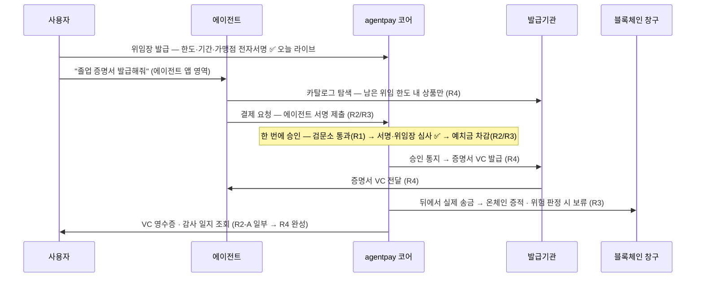
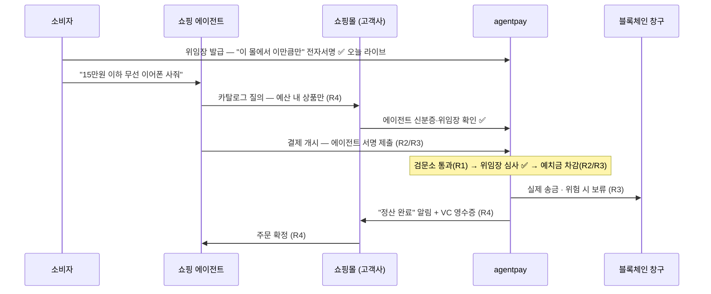

# agentpay 제품 로드맵 — 관계자 논의자료 (2026-07-10)

> **독자**: 기술+사업 혼합 관계자. **목적**: 이 자료로 우선순위·범위·제품 구성을 논의하고 §8의 표결 5건을 결정한다.
> **시간축 없음** — 단계(릴리즈)와 순서만 다룬다.
> **논의용 렌더링 버전**: 같은 폴더의 [`2026-07-10-agentpay-roadmap.html`](./2026-07-10-agentpay-roadmap.html) (동일 내용, 시각화).
> 근거: [설계 스펙 2026-07-07](./2026-07-07-agent-payment-mvp-design.md) · [가드레일 G1 스펙 2026-07-08](./2026-07-08-guardrail-component-design.md) · `docs/CURRENT_STATE.md`

---

## 0. 용어 한 줄 (이 자료에 반복해서 나오는 개념)

| 용어 | 뜻 |
|---|---|
| **DID** | 에이전트·사용자의 **디지털 신분증**. 위조 불가능한 서명 키에서 만들어져, 서명만 보고 "진짜 그 에이전트인지" 확인할 수 있다. |
| **mandate (AP2)** | 사용자가 에이전트에게 써 주는 **전자 위임장**. "이 에이전트가 내 돈을 어디서·얼마까지·언제까지 쓸 수 있다"를 전자서명으로 못박은 문서. |
| **VC** | 위조 여부를 기계가 검증할 수 있는 **디지털 증명서** 국제 표준(W3C). 졸업증명서·자격증·영수증이 모두 이 형식으로 발급될 수 있다. |
| **가드레일 / admission** | 요청이 실행되기 전 거치는 **보안 검문소** / 그 **통과 판정**. 이상한 요청(해킹 시도·정보 유출·규정 위반)을 거르고, 전 건을 기록한다. |
| **custody (커스터디)** | 고객이 맡긴 돈(예치금)을 보관·기장하는 **금고와 장부**. 결제는 이 장부에서 차감된다. |
| **정산 / 온체인** | 장부상 차감된 돈을 실제로 **블록체인에서 송금**하는 것. 블록체인 기록이라 지울 수 없는 **증적**이 남는다. |

## 1. 원칙 — 표준을 따르고, 양측을 모두 갖춘다

1. **기능을 발명하지 않는다 — 표준을 따른다.** 표준 셋: DID(did:key/web) · A2A · AP2 · W3C VC · x402 · ACP · MCP.
2. 각 표준에는 **요청 측**(에이전트·클라이언트 — 사러 가는 쪽)과 **서빙 측**(수용 기업·서버 — 받아주는 쪽)이 있다. **양측을 모두 구현하면 한쪽만도 팔 수 있고, 양쪽 묶음도 팔 수 있다.** §2 매트릭스의 칸 하나가 판매 단위다.
3. 하나의 공통 코어(순수 Java, 헥사고날 포트)에서 부분집합을 골라 **3가지 배포 모델**을 모두 지원한다: 임베드 라이브러리 납품 / 구축형 서버 납품 / 자사 운영 플랫폼.
4. **가드레일(보안 검문소)은 판매 이전에 우리 플랫폼 자신의 모든 요청 경로에 기본 내장**된다 — 고객이 사는 것은 우리 돈 흐름 앞에 두는 것과 동일한 코드다. 단독 판매는 내장의 파생 상품.

## 2. 표준 × 양측 매트릭스 — 판매 단위

상태: ✅ done(기능 동작·테스트 잠금) · 🔨 wip(진행 중) · ⬜ todo(예정)

| 표준 — 무엇을 하는 규칙인가 | 요청 측 — 에이전트·클라이언트에 판매 | 서빙 측 — 수용 기업·서버에 판매 |
|---|---|---|
| **DID** — 디지털 신분증 (did:key·did:web) | ✅ 신분증(키·DID) 만들기, 요청에 서명 *(코어 완료 · SDK 포장 예정)* | ✅ 들어온 요청이 진짜 그 에이전트인지 서명으로 확인 |
| **A2A** — 에이전트끼리 서로를 찾고 소개하는 표준 (AgentCard = 명함) | ⬜ 다른 에이전트의 명함 조회·검증·일 시키기 | ✅ 내 명함(능력·연락처·공개키) 게시 ※1 *(태스크 수신은 예정)* |
| **AP2** — 에이전트 결제 위임 표준 (mandate = 전자 위임장) | 🔨 위임장 작성·전자서명 ※1 *(서명 엔진 완료 · 고객 앱용 SDK 미착수)* | ✅ 위임장 진위 확인·조건(한도·기간·가맹점) 심사·회수 ※1 *(위조·변조 시 즉시 거부 — 테스트로 잠김)* |
| **W3C VC** — 디지털 증명서 표준 (권한증·영수증) | ⬜ 증명서 지갑 — 권한증 보관·제시 | ⬜ 발급·검증기관 — 에이전트별 권한증 발급·확인·회수 *(credential 코어 신설 · 회사 DID/VC 인프라 연결)* |
| **x402** — 웹 결제 요청·지불 절차 표준 | ⬜ "결제 필요(402)" 응답을 받아 서명하고 지불 | ⬜ 결제 요구서 발행·지불 확인·송금 실행 *(송금 주체는 agentpay — 몰은 알림·연동 키트가 기본, 구축형 선택 시 금고 운영 책임 이전 ※2)* |
| **ACP** — AI 에이전트가 읽는 상품 카탈로그·주문 표준 | ⬜ 카탈로그 읽기·조건 검색·주문 넣기 | ⬜ 카탈로그 내놓기·주문 받기 *(기존 몰에 붙이는 커넥터 · ACP(OpenAI/Stripe 진영)와 AP2/x402(Google 진영)는 별도 생태계 — 둘 다 수용)* |
| **MCP** — AI(Claude 등)에 기능을 "도구"로 꽂는 표준 | (요청측은 AI 호스트가 담당 — 우리가 만들 것 없음) | ⬜ agentpay 전 기능을 AI가 바로 쓰는 도구로 노출 |

**정직성 각주**
- ※1 **done = 기능이 실제로 돌아가고 테스트로 잠겨 있다**는 뜻. 국제 표준 문서와의 세부 wire-format 대조는 별도 항목(설계 스펙 §18)이며, 차이는 어댑터 계층에서 흡수한다. 현재 구현은 AP2 개념을 따른 자체 EIP-712 구조.
- ※2 배포 형태: 현재 코드는 `:app` 모놀리스 안에 있다 — **부품만 떼어 파는 임베드 라이브러리는 모듈 분리 작업(R2) 후** 가능(헥사고날 경계 덕에 추출 비용 낮음). 오늘 가능한 것은 서버째 구축·라이브 시연.

## 3. 컴포넌트 지도 — 4개 레이어 + 횡단 가드레일

### 3.1 공통 코어 — 모든 라인업이 공유하는 공용 부품 (외부 인프라 없이 도는 순수 Java)
- ✅ **agentpay-commons** — 서명·신분증의 원자 부품: 전자서명 만들기/확인하기, DID 인코딩 (secp256k1·EIP-191/712·did:key/web)
- ✅ **identity 코어** — 에이전트 명부: 등록 받고, "본인 맞나" 서명 시험으로 확인
- ✅ **delegation 코어** — 위임장 관리: 진위 확인, 조건(한도·기간·가맹점) 심사 규칙(PolicyEngine)
- ⬜ **credential 코어** *(신설)* — 권한증 관리: 에이전트별 권한 증명서(VC) 발급·확인·회수
- ⬜ **custody·payment 코어** — 금고와 결제 심장: 예치금 장부, 결제 승인·차감을 단일 트랜잭션으로
- ⬜ **audit 코어** — 감사 일지: 모든 일을 지울 수 없게 기록(append-only), 영수증 발급

### 3.2 가드레일 — 횡단, 전 경로 기본 내장 (레이어가 아니라 모든 경로에 가로로 걸리는 검문소)
"보안 검사 → 돈 규칙 심사 → 실행" 순서, 예외 경로 없음. 단독 판매는 파생.
- 🔨 **guardrail-core** — 검문소 본체: 위험 패턴(해킹 시도·정보 유출) 탐지 규칙 (T1 뼈대 완료, 조립 예정)
- ⬜ **즉시 판정 + AI 심층 분석** — 통과/차단은 그 자리에서, AI(sLLM) 정밀 분석은 비동기로 — 속도 저하 없음
- ⬜ **inspection 원장** — 검문 기록부: 전 건 기록, 감사 증적이자 탐지 규칙 개선 데이터 자산
- ⬜ **OPA·Presidio·Ollama 어댑터** — 외부 전문 엔진 연결: 정책 심사·개인정보 탐지·로컬 AI (없어도 기본 모드로 동작)
- ⬜ **단독판매 표면** — 같은 검문소를 고객 시스템에 심는 라이브러리 / HTTP로 호출하는 서버

### 3.3 표준 어댑터 — 표준별 맞춤 부품 (새 표준 수용 = 이 부품만 교체, 코어는 그대로)
- ✅ did:key/did:web (신분증 두 종) · ✅ A2A AgentCard (명함 게시) · ✅ AP2 Mandate (위임장 형식·서명)
- ⬜ W3C VC (증명서 — 권한증·영수증) · ⬜ x402/EIP-3009 (웹 결제 절차 + 블록체인 송금) · ⬜ ACP+schema.org (에이전트용 카탈로그)
- ⬜ 후보 stub — 차세대 표준 대비석 (UCAN·did:ethr·ERC-4337·카드/계좌 등, 자리만 미리 파 둠)

### 3.4 서버 — 같은 부품을 담아 돌리는 본체 (구축형 납품 / 자사 운영 둘 다)
- ✅ **core-service** — 플랫폼 본체 (명부·위임장 탑재, 금고·결제·감사 예정)
- ⬜ **evm-gateway** — 블록체인 창구: 입금 감지·송금 실행 (블록체인 기술을 이 서버에만 격리)
- ⬜ **guardrail-server** — 검문소의 서버 모드 (비Java 고객도 HTTP로 호출)
- ⬜ **commerce 커넥터** — 고객사 쇼핑몰과 플랫폼을 잇는 다리

### 3.5 통합 표면·SDK — 고객 손에 들어가는 것 (어떤 AI 생태계든 접속하게 하는 얇은 포장)
- ⬜ **agentpay-client SDK** — 고객 앱용 연동 키트: 키 보관, 위임장·결제 서명, API 호출 대행
- ⬜ **MCP 서버 · 스킬·플러그인 팩** — Claude·GPT 등 AI가 agentpay를 바로 쓰게 하는 생태계별 포장
- ⬜ **agent-cli** — 시연·검증 도구 (데모의 에이전트 역할)
- ⬜ **웹훅 계약** — "정산 완료"를 고객 시스템에 자동 통지하는 약속된 형식 (mall-agnostic)

> 이전 논의의 라인업 "가드레일 단품"과 "Any-Agent 접속"은 각각 **내장 가드레일의 파생 상품**과 **통합 표면 레이어**로 흡수 — 집중 라인업은 아래 2개다.

## 4. 집중 라인업 Ⅰ — 금융기관·핀테크: 위임증명·권한 VC 패키지

**제안**: 이미 실물로 돌아가는 위임 코어(위임장 발급→진위 확인→회수, 위조 시 즉시 거부) 위에, 금융권이 이미 신뢰하는 VC 표준으로 **에이전트별 권한증 발급·회수와 검증가능 영수증·감사 추적**을 얹는다 — "누가·어느 에이전트에·얼마까지·언제까지"를 나중에 부인할 수 없는 **서명 증거 체인**으로. 회사 DID/VC 본업과 같은 표준이라 기존 금융권 신뢰 채널의 연장선.

**구성도 (구축형 중심 — 기관 내부에 설치)**

| 금융기관 인프라 (고객사 존) | agentpay (우리 존) |
|---|---|
| ✅ core-service 구축형 (명부·위임장 관리 탑재) | ✅ 공통 코어·어댑터 공급 (업데이트 채널, 가드레일 개선분 포함) |
| ⬜ credential 코어 (권한증 발급·확인·회수) | 🔨 agentpay-client SDK (기관 고객앱용 위임장 서명 키트) |
| 🔨 가드레일 내장 (전 요청 검문 + 검문 기록부 = 내부통제 증적) | ⬜ (선택) 운영형 호스팅 |
| ⬜ audit (감사 일지 · VC 영수증) | |
| ⬜ 기관 기존 DID/VC 인프라 연결 (부품 교체 방식 — **호환 확인 필요**) | |

배포: **구축형 서버** 중심(양측 묶음). 임베드는 모듈 분리(R2) 후. 요청측 SDK만 별도 판매 가능.

**유스케이스 — "졸업 증명서 발급해줘"**
고객이 자기 에이전트에게 말하면 → 에이전트가 발급기관 카탈로그에서 증명서 발급 서비스(무형 상품, 오픈배지 = VC)를 찾고 → 미리 서명해 둔 위임장 한도 안에서 수수료를 결제 → 증명서가 위조 검증 가능한 VC로 발급 → 예치금 차감 후 블록체인에서 실제 송금(지울 수 없는 증적) → 전 과정이 VC 영수증·감사 일지로 검증 가능. 증명서 발급은 설계 스펙 §11의 상품 타입 `SERVICE_FEE`로 이미 존재하는 흐름이다.

**오늘 라이브로 가능한 데모**: 위임장 발급 → 진위 확인 → **위조 위임장 즉시 거부** → 소유자 서명 회수. (한도·가맹점·만료 심사는 테스트 스위트로 실증 — 라이브 결제는 결제 코어 구현 후.)

**단계별 판매**: 지금 = 위임 증명 코어 라이브 데모 + 구축형 PoC → R1~R2 = 검문 기록부 + 권한증 관리로 **본판매 개시** → R3~R4 = 결제·송금·VC 영수증까지 증거 체인 완성, 3배포 모델 전부.

## 5. 집중 라인업 Ⅱ — 커머스 사업자: 에이전트 커머스 수용 패키지

**제안**: AI 에이전트의 구매 트래픽을 차단할 봇이 아니라 **검증된 매출**로 — "누가, 어떤 권한으로" 사는지 디지털 신분증·전자 위임장으로 확인하고, 에이전트가 읽는 카탈로그 표준(ACP)으로 탐색·주문을 받고, **정산 결과는 알림(웹훅)·연동 키트로 수신**. 내장 검문소가 비정상 주문을 실행 전에 거른다. 위임·결제의 서명 체인은 **나중에 부인할 수 없는 증거**(내부 심사·감사·소명용 — 카드사 분쟁 절차에서의 효력은 검토 항목).

**구성도 (운영형 기본 + 커넥터 — 몰은 가볍게 연결만)**

| 쇼핑몰 (고객사 존) | agentpay (우리 존 — 운영형) |
|---|---|
| ⬜ 웹훅 수신 + 연동 키트 (기본 구매 단위 — "정산 완료" 알림 받고 주문 확정) | ✅ core-service (위임장 관리 ✅ + 금고·결제 승인·감사 예정) |
| ⬜ ACP 카탈로그 커넥터 (기존 상품 DB → 에이전트용 표준 카탈로그) | ⬜ evm-gateway (입금 감지 · 실제 송금 실행) |
| ✅ (선택) 검증 게이트 (신분증·위임장 확인 — 코드 완료, 부품 분리는 R2) | 🔨 가드레일 내장 (전 경로 검문 + 위험 판정 시 송금 보류) |
| 🔨 (선택) 가드레일 임베드 (주문 검문소 — 외부 인프라 없이 동작) | |

배포: **운영형 기본** — 금고·송금은 agentpay가 운영, 몰은 알림·연동 키트만. **구축형 선택 시 금고 운영 책임이 고객사로 이전**됨을 계약에 명시. **수요 전제(정직)**: 지금 판매는 에이전트 트래픽 대비 선행 구축(퍼스트무버) 제안 — 실트래픽은 쇼핑 에이전트 생태계 확산에 종속.

**유스케이스 — "15만원 이하로 무선 이어폰 사줘"**
소비자가 에이전트에게 말하면 → 에이전트가 몰의 카탈로그를 남은 위임 한도(`maxBudget`)로 필터해 탐색 → 몰은 들어온 요청의 신분증·위임장을 확인하고 주문 수신 → 결제는 위임장 한도 안에서만 승인·차감 → 정산 완료가 알림으로 몰에 통지. **탐색 자체가 위임된 예산에 묶인다**는 것이 킬러 데모.

몰이 사는 것 = 자기 존의 칸(카탈로그 커넥터·검증 게이트·알림 수신)뿐 — 금고·송금 레일은 운영형에서 agentpay 책임.

**단계별 판매**: 지금 = 신분증·위임장 검증 게이트 PoC + 가드레일 파생 단품 데모 → R2-B~R3 = "위임 예산 안에서만 승인·차감 + 비정상 주문 검문 차단" 라이브 → R4 = 카탈로그 탐색·주문 + 알림·영수증으로 **엔드투엔드 본판매**.

## 6. 릴리즈 로드맵 — 공통 확정 구간 + 분기점 1개

기한 없음 — 순서와 스코프만. 🆕 신규 개발 · 🔧 기존 수정·확장 · ♻️ 그대로 재사용 · [S/M/L] 상대 크기.
**R1은 두 안 공통(기존 결정의 이행 — `NEXT_STEP.md`의 "Phase 3은 G1에 밀려 보류" + 진행 중 브랜치 `guardrail-g1`)**이고, 실제 표결 대상은 R2 분기 하나다.

### R1 — 신뢰 코어: 가드레일 내장 완성 (공통 확정 구간)
> **끝나면**: 모든 요청이 검문소를 지나고 전 건이 기록부에 남는 플랫폼 — 핀테크 PoC에 "내부통제 증적" 서사 추가, 가드레일 파생 상품 데모 가능, 검문 속도 실측치 확보.
- 🆕 검문소 조립: 즉시 판정 엔진 + AI 심층 분석 무지연 배선 + `:app` 통합 + 검문 기록부 (G1 T2~T4) [M]
- 🔧 기존 경로(에이전트 등록·위임장 발급)에 검문소 소급 설치 — 이후 새 경로는 처음부터 내장 [S]
- 🆕 사전 확인 스파이크: 회사 기존 VC 인프라의 secp256k1/EIP-712 호환 검증 → **표결 1의 입력** [S]
- ♻️ 에이전트 명부·위임장 관리·심사 규칙 (완료분 그대로)

**G1을 R1에 두는 근거**: (a) 결제 승인 경로(Phase 4)를 만들 때 가드레일 포트가 이미 있어야 "보안 가드→금융 정책→실행"을 처음부터 배선 — 나중에 끼우면 경로마다 retrofit이고 "기본 내장" 주장이 사후 조립이 됨. (b) R3 송금 안전장치(G2)의 전제인 비동기 판정 기록이 선행돼야 함. (c) 기존 결정의 이행. 단, 외부 엔진 어댑터(T5~T8)는 기본 모드만으로 동작하므로 게이트가 아니라 R3 병행.

### R2 — 분기점 (표결 1: 검문소 완성 직후, 다음 한 칸)

**R2-A. 권한증(credential) 먼저 — 추천 (호환 스파이크 결과 조건부)**
> **끝나면**: **핀테크 본판매 개시** — "기관이 에이전트에 권한증 발급 → 제시·확인 → 회수하면 즉시 거부" + 위임 전 구간 + 기록부 증적 라이브.
- 🆕 credential 코어 — 에이전트별 권한증(VC) 발급·확인·회수 (회사 인프라를 포트 뒤 어댑터로) [M]
- 🆕 위임·권한증 이벤트의 감사 기록 (audit 선행분) [S]
- 🔧 agentpay-client 씨앗 — 위임장 서명 SDK (AP2 요청측) [S]
- 🔧 부품 분리 — 검증 게이트를 떼어 파는 라이브러리 아티팩트로 (임베드 납품 전제) [S~M]

**R2-B. 금고·결제 먼저**
> **끝나면**: **돈이 실제로 도는 골격 관통**(walking skeleton) — "예치된 위임 예산 안에서만 승인·차감" 라이브, 커머스·핀테크 공통 골격.
- 🆕 custody 코어 — 예치금 금고·장부 + 입금 감지 + ChainGateway 어댑터 (Phase 3) [M]
- 🆕 결제 승인 단일 트랜잭션 — 검문→위임장 심사→차감 (Phase 4, 처음부터 검문 배선) [M]

커머스 파트너 레퍼런스 확보가 핀테크 첫 계약보다 급하다는 영업 신호가 있으면 R2-B.

### R3 — 남은 한쪽 + 송금 개통
> **끝나면**: 예치→승인→블록체인 송금·증적 전 구간 — AI 심층 분석이 위험 거래의 송금을 보류시키는 안전장치까지, 핀테크 풀 컴플라이언스 데모.
- 🆕 R2에서 안 한 쪽 (권한증 또는 금고·결제) [M]
- 🆕 x402 결제 절차 + evm-gateway — 실제 송금 실행 (Phase 5) [M]
- 🆕 송금 안전장치(G2) — 송금 전 보류 시간(홀드백)을 두고, 그 사이 도착한 AI 위험 판정만 반영·미도착 시 진행+사후 표시, 위험 판정 시 몰에 주문 보류 통지 [S]
- 🆕 외부 전문 엔진 — 정책 심사(OPA)·개인정보 탐지(Presidio) (G1 T5·T6, 기본 모드로도 돌므로 병행) [M]

### R4 — 커머스 접점 · 완제
> **끝나면**: **커머스 엔드투엔드 본판매**(탐색→위임 한도→결제→알림·VC 영수증) + 3가지 배포 모델 완성 — "졸업 증명서 발급" 유스케이스 풀 데모.
- 🆕 에이전트용 카탈로그·주문 수용(ACP) + "예산 내 상품만 탐색"(maxBudget) 킬러 데모 + 주문 검문 (Phase 6) [M]
- 🆕 VC 영수증 완성 + "정산 완료" 웹훅 + mall-agnostic 표준 연동 계약 (Phase 7 + 스펙 §11-B) [M]
- 🆕 MCP 서버 · 스킬·플러그인 팩 (통합 표면) [S]
- 🔧 로컬 AI(Ollama) 연결 · compose·프로파일 정리 (G1 T7·T8) [S]
- 이후: 정책 관리 화면(G3) · 생태계 훅 어댑터(G4) · 차세대 표준 후보 확장(G5)

## 7. 전제와 열린 질문 — 답을 지어내지 않고 선점한다

| 질문 | 현재 입장 |
|---|---|
| **예치금 보관 규제 (VASP)** | 운영형 = 우리가 고객 돈(스테이블코인) 보관 → 가상자산사업자 신고 대상 여부 검토가 **운영형 모델의 선행 조건**. 구축형·임베드는 운영 주체가 고객사라 부담 이전 — 배포 모델 선택이 곧 규제 부담 배분. |
| **원화 결제 레일** | 현재 설계는 스테이블코인 송금. 카드·계좌이체는 교체 부품 자리(stub)만 확보 — 요구 시 어댑터 추가로 흡수. 스테이블코인 규제 방향은 모니터링. |
| **회사 VC 인프라 호환** | 기존 DID/VC 인프라의 secp256k1/EIP-712 지원 미확인 → **R1 스파이크**. 불일치 시 대안: 자체 발급 + 회사 인프라는 검증측만 재사용, 또는 이중 서명. **표결 1은 이 결과 조건부.** |
| **표준 세부 형식 적합성** | AP2·A2A "done"은 기능 동작 기준. 공식 규격 wire-format 대조는 미실시(스펙 §18) — 차이는 어댑터 계층에서 흡수. |
| **검문 기록부 데이터 적법성** | 기록부를 AI 학습 자산으로 쓰려면 개인정보 제거·동의 설계 검토 필요. 감사 증적 용도와 학습 용도 분리 설계. |
| **가드레일 오탐·미탐 책임** | 납품(고객 운영) vs 운영형(우리 운영)별 보안 책임 경계를 계약으로 정의. "사람 승인 대기" 보류 건의 승인 주체·제한시간 포함. |
| **검문 속도** | "속도 저하 없음"은 AI 심층 분석(비동기)에 해당. 즉시 판정은 기본 모드 기준 저지연 — R1 완료 기준에 실측 포함, 수치는 측정으로 교체. 외부 엔진 연결 시 ms대. |
| **커머스 콜드스타트 · 경쟁 구도** | 에이전트 구매 실트래픽은 쇼핑 에이전트 생태계(ChatGPT·Gemini) 확산에 종속 — 지금 판매는 퍼스트무버 선행 구축 제안. 카탈로그·결제 표준은 OpenAI/Stripe 진영(ACP)과 Google 진영(AP2/x402)이 경쟁 중 — **부품 교체 구조로 양 진영 모두 수용**이 이 아키텍처의 실제 차별점. |

## 8. 결정 요청 — 이 자리에서 표결할 것

1. **[표결 1 — 유일한 로드맵 분기]** R1(검문소 내장) 직후의 한 칸: **권한증 관리(R2-A, 추천 — VC 인프라 호환 스파이크 결과 조건부)** vs 금고·결제(R2-B). 판단 기준: 핀테크 첫 계약 vs 커머스 파트너 레퍼런스 중 어느 쪽이 급한가.
2. **[표결 2]** 가드레일 "본판매 가능" 인정 기준: 기본 모드(내장 규칙)만으로 인정 vs 외부 전문 엔진(OPA·Presidio) 연결까지 필수.
3. **[표결 3]** 감사 기록의 분할 출시: 위임·권한증 증적만 조기 출시(R2-A 포함) vs 결제 실거래 후 일괄(R3~R4).
4. **[표결 4]** 고객 앱용 연동 키트(SDK) 시점: R2 씨앗 vs R4에서 웹훅·표준 연동 계약과 묶음.
5. **[표결 5]** 가드레일 단독판매 출시 시점: 내장 완성(R1) 즉시 파생 출시 vs 자사 결제 트래픽 실적(R2-B/R3 이후) 확보 후 "우리가 우리 돈 앞에 두고 쓴다" 근거와 함께 출시.

---

*작성 과정: 기존 설계 스펙·G1 스펙·구현 상태를 근거로 다중 에이전트 설계(가드레일 내장·커머스·핀테크 병렬) + 순서 설계 + 적대적 검토를 거쳐 과장 표현(임베드 납품 가능·x402 서빙측 판매 범위·A2A 양측 done)을 정직화했다.*
